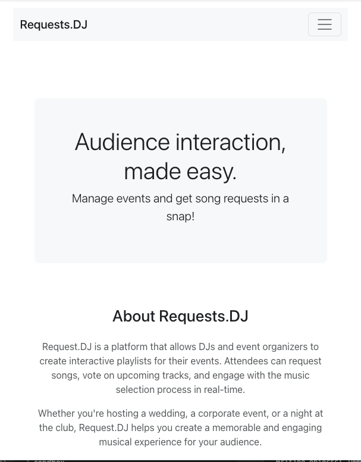
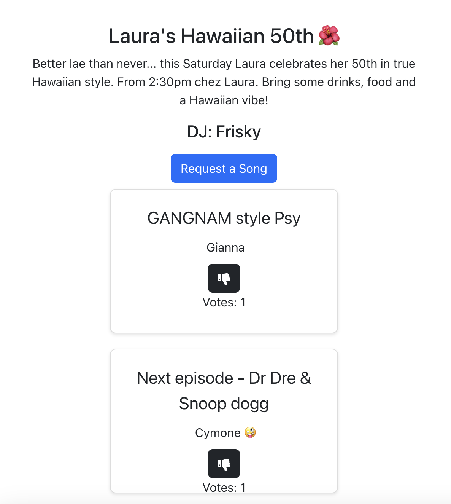

# REQUESTS DJ v2

Requests DJ refactored MERN styles.

## Description

The ultimate song request management app for DJs and party guests! DJs can create events that guests can use to make song requests, both in the days leading up to and event and during the event itself. It's a great tool for a DJ to play the songs that the guests want to hear!

## Table of Contents

- [Directory Structure](#directory_structure)
- [Usage](#usage)
- [Technology](#technology)
- [Screenshots](#screenshots)
- [Credits](#credits)

## Directory_Structure

```md
├── requests-dj/
  ├── assets/
    ├── images/
  ├── client/
    ├── src/
      ├── components/
      ├── pages/
      ├── utils/
  ├── server/ 
    ├── config/
    ├── models/
    ├── schemas/
    ├── utils/                                    
```

## Usage

Deployed link on Render.com: [Requests DJ](https://requests.dj/ "link to deployed app")

## Technology

- Node
- Express
- MongoDB / Mongoose
- Apollo Server / GraphQL
- React
- JavaScript
- Render
- Bootstrap
- JWT

### Screenshots




## Credits

[Jeremy White](https://github.com/roughnut "Jeremy's Github profile")
[Lachlan Hughes](https://github.com/CinosMagician "Lachlan's Github profile")
